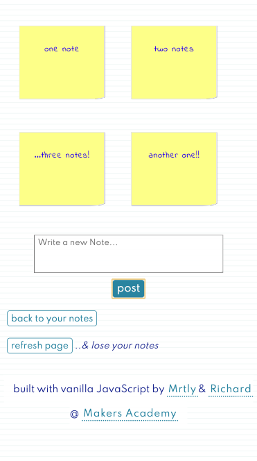

###  Notes App with JavaScript

 
#### The idea
A frontend, single page app using only pure JavaScript.
 
 
As part of this primary goal, a sub-goal should be that we are able to explain and give an example of asynchronous behaviour in Javascript.

##### Specification

a user can:
- [x] see a list of the notes; each note is abbreviated to the first 20 characters
- [x] see the full text of an individual note on its own page
- [x] create a new note
 

* notes are not permanently stored; if the user refreshes their web page, they'll lose their notes

#### Built with

vanilla JavaScript, following TDD

##### Visit

[vanilla-notes.surge.sh](http://vanilla-notes.surge.sh/)

##### View

##### Run

`git clone` this repo, and open index.html in a browser

##### Test

the test results live in the console!  
(open devtools, go to console)

##### Notes
Week 7 @ Makers Academy:
* Build a front-end app in Javascript 
* Work competently in Javascript 
* Reason about asynchronous behaviour in Javascript

#### Collaborators
[Myrtle](https://github.com/Mrtly) & [Richard](https://github.com/richardpattinson)
 
